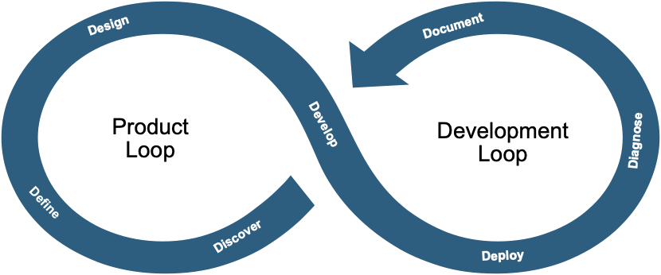

<p align="center">
  
</p>

# SevenD — April Release

> **Why SevenD?** AI agents write code fast — SevenD makes sure they build the *right* thing, in the right order, and know when to stop and ask.

A progressive framework for building software with AI coding agents. Structure your project so AI agents know what to read, what to build, and when to stop and ask.

<p align="center">
  
</p>

## The Problem

AI coding agents produce better output when they have structured context. Without it, they invent component names, skip tests, build features nobody asked for, and lose track of what's been decided. SevenD gives your project a skeleton that any AI agent can follow.

## What's New (April Release)

- **Sprint-based INDEX files** -- Every phase folder uses an INDEX.md linking to sprint files. Work is non-linear; the structure matches.
- **Build + Bug sections** -- Every sprint has both. Sprints close only at zero bugs.
- **reference/ directory** -- Stable documents (architecture, components, contracts, decisions, agent rules) live separately from active work.
- **STATUS.md** -- Root-level dashboard. One glance to know where the project stands.
- **Sprint archiving** -- Closed sprints move to `reference/archive/` to keep working directories clean.
- **Sprint reports** -- Built into every sprint file. Metrics and learnings captured at close.

## Grok Bots — Now Generally Available

Seven Grok-powered Project Manager bots, one per phase of the 7 Ds. Give a PM bot the complete input for its phase — an approved backlog item, an approved spec, a completed design — and it runs that phase to a gate-passing output, then hands off to the next bot.

📄 **[Grok Bots page: what they do, and how to use them](https://ashvinnaik.github.io/SevenD/bots.html)**

| Phase | Loop | Bot | Link |
|-------|------|-----|------|
| Discovery | Product | Discovery PM | https://x.ai/bot/ht_c0Ev0JRc1O1FAwjsVV |
| Definition | Product | Definition PM | https://x.ai/bot/lCPi6D5Smr2QP1QA5_cMr |
| Design | Product | Design PM | https://x.ai/bot/Q6JhV9jLLQtX6r7bRTCG_ |
| Documentation | Bridge | Document PM | https://x.ai/bot/xheAbAQYQT4esSGc8B3xX |
| Development | Tech | Development PM | https://x.ai/bot/fhHvohYNURwk9JwiK7H7U |
| Diagnostics | Tech | Diagnostics PM | https://x.ai/bot/Iz3asXRLoLC8Pr0gZYGdE |
| Deployment | Tech | Deployment PM | https://x.ai/bot/EdkMNLrTT0WLNDQYN-l-e |

Same phase gates as the framework apply: no spec without an approved backlog item, no design without an approved spec, no development plan without a completed design, no deployment without diagnostics passing.

## Four Levels

Pick the level that matches your project. You can always upgrade.

| Level | Files | For | What you get |
|-------|-------|-----|-------------|
| **1** | 2 files | Solo, weekend, prototype | Product.md + Tech.md |
| **2** | 4 files | Small team, real project | + Architecture.md, Resources.md, Project.md |
| **3** | 7 folders + reference/ | Complex project, weekly sprints | Phase INDEX + sprint files, reference docs, STATUS.md |
| **4** | GitHub-native + reference/ | Team on GitHub, CI/CD | Issues, Actions, PR gates + stable reference docs |

Every level includes IDE rules for **Claude Code**, **Cursor**, **Windsurf**, and **VS Code Copilot**.

## Quick Start

### Option 1: Copy the templates

```bash
# Clone the repo
git clone https://github.com/Ashvinnaik/SevenD.git

# Copy the level you need into your project
cp -r SevenD/level-1/ my-project/    # Solo / prototype
cp -r SevenD/level-2/ my-project/    # Small team
cp -r SevenD/level-3/ my-project/    # Complex project
cp -r SevenD/level-4/ my-project/    # GitHub-native

# Fill in the templates with your project details
# Replace [placeholders] with real content
```

### Option 2: Use the Claude skill (recommended)

The skill walks you through assessment, picks the right level, and generates files filled in with your actual project details instead of placeholders.

**Claude Code (CLI):**
```bash
# Install the skill
cp -r SevenD/skill/ ~/.claude/skills/SevenD/

# Start a conversation
claude

# The skill triggers automatically when you say:
# "set up my project" / "add a feature" / "sprint review"
```

**Claude.ai (Projects):**
1. Create a new Project in Claude.ai
2. Paste the contents of `skill/project-instructions.md` into **Custom Instructions**
3. Upload these 6 files to **Project Knowledge**:
   - `skill/SKILL.md`
   - `skill/7Dkb.md`
   - `skill/templates.md`
   - `skill/levels-overview.md`
   - `skill/ide-rules-format.md`
   - `skill/upgrade-paths.md`
4. Start a conversation: "Help me set up my project"

## The 7 Ds

| Phase | Loop | What happens |
|-------|------|-------------|
| **Discovery** | Product | Identify what to build and why |
| **Definition** | Product | Specify requirements and acceptance criteria |
| **Design** | Product | Architect components, interfaces, standards |
| **Documentation** | Bridge | Track status across all phases |
| **Development** | Tech | Build it in time-boxed sprints |
| **Diagnostics** | Tech | Verify correctness and quality |
| **Deployment** | Tech | Ship, monitor, learn |

Phase gates prevent premature advancement: no Design without approved Definition, no Development without completed Design, no Deployment without Diagnostics passing.

## Level 3 Structure (April Release)

```
project/
├── STATUS.md                      # Current state at a glance
├── reference/                     # Stable docs (change slowly)
│   ├── ARCHITECTURE.md            # System architecture
│   ├── COMPONENTS.md              # Component registry
│   ├── CONTRACTS.md               # Interface contracts
│   ├── DECISIONS.md               # Decision log
│   ├── AGENT.md                   # AI agent rules
│   └── archive/                   # Closed sprints
├── 01-discovery/
│   ├── INDEX.md                   # Phase index + sprint links
│   └── D1-Sprint1.md              # Sprint with Build + Bug sections
├── 02-definition/
│   ├── INDEX.md
│   └── D2-Sprint1.md
├── 03-design/
│   ├── INDEX.md
│   └── D3-Sprint1.md
├── 04-documentation/
│   ├── INDEX.md                   # Product status board
│   └── D4-Sprint1.md
├── 05-development/
│   ├── INDEX.md
│   └── D5-Sprint1.md
├── 06-diagnostics/
│   ├── INDEX.md
│   └── D6-Sprint1.md
├── 07-deployment/
│   ├── INDEX.md
│   └── D7-Sprint1.md
└── CLAUDE.md / .cursor/ etc.      # IDE rules
```

## What the Skill Does

The SevenD skill covers the full lifecycle:

- **Initial setup** -- Assess your project, recommend a level, generate customized files
- **Feature workflow** -- Walk through all 7 phases for your level, pointing to exact files
- **Sprint operations** -- Start sprints, run reviews, close at zero bugs, archive
- **Level upgrades** -- Migrate from one level to the next without losing content
- **Agent debugging** -- Diagnose why your AI agent isn't following the framework

## Repo Structure

```
SevenD/
├── level-1/           # Two files (Product.md + Tech.md + IDE rules)
├── level-2/           # Four files (+ Architecture, Resources, Project + IDE rules)
├── level-3/           # Phase folders + reference/ + STATUS.md + IDE rules
├── level-4/           # GitHub-native + reference/ + STATUS.md + IDE rules
├── skill/             # Claude skill for guided setup and operations
│   ├── SKILL.md               # Operating instructions
│   ├── 7Dkb.md                # Methodology, vocabulary, conventions
│   ├── templates.md           # File structures for all levels
│   ├── levels-overview.md     # Decision matrix and file inventories
│   ├── ide-rules-format.md    # IDE rule file format specs
│   ├── upgrade-paths.md       # Level migration guides
│   └── project-instructions.md # Claude.ai project custom instructions
└── README.md
```

## License

MIT
